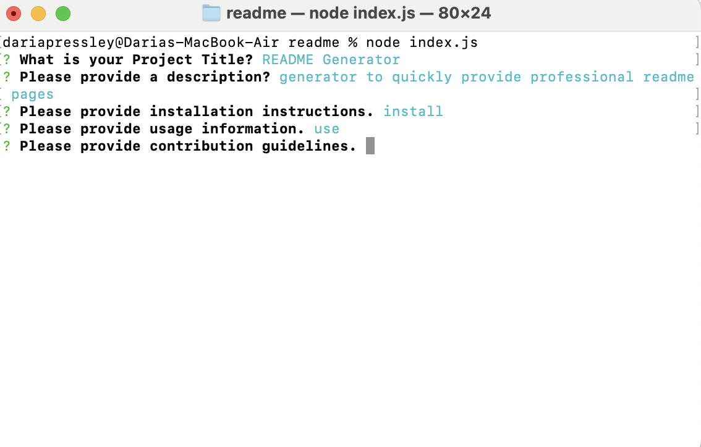

# README Generator
Weather Forecast API Project

## Description

This README generator quickly creates a professional README for new projects.

## Acceptance Criteria

It is done when...

## Github Page

https://github.com/DariaPressley/readme

## Credits

Eric Sayer (UCLA Tutor) for overall guidance with the markdown file.

## License

Please refer to the LICENSE in the repo.

